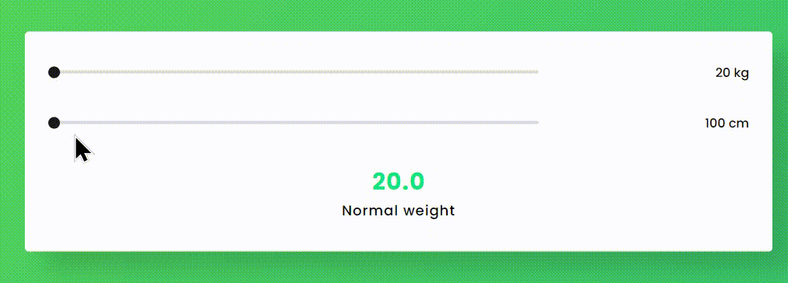

# 
 Hi there 👋 I'm Mohammad Hossein 👨‍💻 

 
 React Js expert and FrontEnd Developer from Iran.

## Description Mini-Project
- A statistical measure is used to compare a person's weight and height.
 
  In fact, this measure does not measure the rate of obesity

  but rather is an appropriate tool to estimate the health of a person's weight according to their height.
  
  Theindex was developed between 1830 and 1850 by the Belgian scientist Adolf Kottel.

- Made with ♥

>### Languages
>> 
>> 
>> 
>> 
>> 

## View of the  Mini-project

check this [URL](https://khadem-mh.github.io/bmi/) for visit this page

___
>### Social Network
> 
> 
> 
> 
> 
